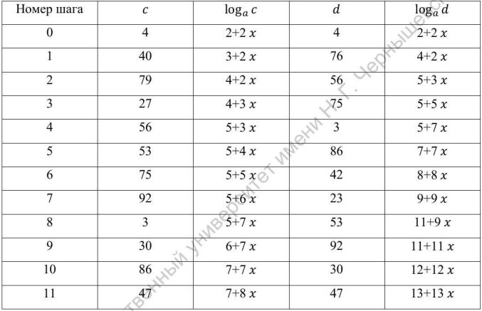
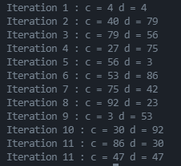

---
# Front matter
lang: ru-RU
title: "Математические основы защиты информации и информационной безопасности"
subtitle: "Лабораторная работа №7 - Дискретное логарифмирование в конечном поле"
author: "Кейела Патачона, группа НПМмд-02-21"

# Formatting
toc-title: "Содержание"
toc: true # Table of contents
toc_depth: 2
lof: true # List of figures
fontsize: 12pt
linestretch: 1.5
papersize: a4paper
documentclass: scrreprt
polyglossia-lang: russian
polyglossia-otherlangs: english
mainfont: PT Serif
romanfont: PT Serif
sansfont: PT Sans
monofont: PT Mono
mainfontoptions: Ligatures=TeX
romanfontoptions: Ligatures=TeX
sansfontoptions: Ligatures=TeX,Scale=MatchLowercase
monofontoptions: Scale=MatchLowercase
indent: true
pdf-engine: lualatex
header-includes:
  - \linepenalty=10 # the penalty added to the badness of each line within a paragraph (no associated penalty node) Increasing the value makes tex try to have fewer lines in the paragraph.
  - \interlinepenalty=0 # value of the penalty (node) added after each line of a paragraph.
  - \hyphenpenalty=50 # the penalty for line breaking at an automatically inserted hyphen
  - \exhyphenpenalty=50 # the penalty for line breaking at an explicit hyphen
  - \binoppenalty=700 # the penalty for breaking a line at a binary operator
  - \relpenalty=500 # the penalty for breaking a line at a relation
  - \clubpenalty=150 # extra penalty for breaking after first line of a paragraph
  - \widowpenalty=150 # extra penalty for breaking before last line of a paragraph
  - \displaywidowpenalty=50 # extra penalty for breaking before last line before a display math
  - \brokenpenalty=100 # extra penalty for page breaking after a hyphenated line
  - \predisplaypenalty=10000 # penalty for breaking before a display
  - \postdisplaypenalty=0 # penalty for breaking after a display
  - \floatingpenalty = 20000 # penalty for splitting an insertion (can only be split footnote in standard LaTeX)
  - \raggedbottom # or \flushbottom
  - \usepackage{float} # keep figures where there are in the text
  - \floatplacement{figure}{H} # keep figures where there are in the text
---

# Цель и задание работы

***Цель***

Научиться дискретному логарифмированию в конечном поле

***Задания к лабораторной работе***

1. Реализовать алгоритм программно.
2. Получить у преподавателя задание, содержащее числа $p,a,b$ и вычислить логарифм.

# Выполнение работы

## Теоретическая часть

Задача дискретного логарифмирования, как и задача разложения на множители, применяется во многих алгоритмах криптографии с открытым ключом. Предложенная в 1976 году У. Диффи и М.Хеллманом для установления сеансового ключа, та задача послужила основой для создания протоколов шифрования и цифровой подписи, доказательств с нулсным разглашением и других криптографических протоколов.

Пусть над некоторым множеством Ω произвольной природы определены операции сложения $«+»$ и умножения $«.»$. Множество Ω называется кольцом если выполняются следующие условия:
1. Сложение коммутативно: $a+b=b+c$ для любых $a,b \in Ω$;
2. Сложение ассоциативно: $(a + b) + c = a + (b+c)$ для любых $a, b,c \in Ω$; 
3. Существует нулевой элемент $0 \in Ω$ такой, что $a+0=a$ для любого $a \in Ω$;
4. Для каждого элемента $a \in Ω$ существует противоположный элемент $-a \in Ω$ такой, что $-a+a=0$; 
5. Умножение дистрибутивно относительно сложения:

$$a.(b+c)=a.b+a.c,  (a+b).c=a.c+b.c,$$

для любых $a,b,c \in Ω$.

Если в кольце Ω умножение коммутативно: $a.b=b.a$ для любых $a,b \in Ω$, то кольцо называется *коммунтативным*.

Если в колые Ω умножение ассоциативно: $(a.b).c = a.(b.c)$ для любых $a, b,c \in Ω$, то кольцо называется *ассоциативным*.

Если в кольце Ω существует единичный элемент $e$ такой, что $a.e=e.a=a$
для любого $a \in Ω$, то кольцо называется кольцом с единицей.

Если в ассоциативном, коммутативном кольце с единицей для каждого
ненулевого элемента $a$ существует обратный элемент $a^{-1} \in Ω$ такой, что $a^{-1}.a = a.a^{-1}=e$, то кольцо называется *полем*.

Пусть $m \in N,m>1$. Целые числа $a$ и $b$ называются *сравнимыми по модулю* $m$ (обозначается $a≡b$(*mod m*)), если разность $a-b$ делится на $m$ Некоторые свойства отношения сравнимости:

1. *Рефлексивность:* $a≡a$(*mod m*). 
2. *Симметричность:* если $a≡b$(*mod m*), то $b≡a$(*mod m*). 
3. *Транзитивность:* если $a≡b$(*mod m*) и $b≡c$(*mod m*), $a≡c$(*mod m*).

Отношение, обладающее свойством рефлексивности, симметричности и 
транитимности, называется *отношением эквивалентности*. Отношение 
сравнимости является отношением эквивалентности на множестве $Z$ целых чисел.

Отношение эквивалентности разбивает множество, на котором оно  определено, на *классы эквивалентности*. Любые два класса эквивалентности либо не пересекаются, либо совпадают.

Классы эквивалентности, определяемые отношением сравнимости, называются *классами вычетов по модулю m*. Класс вычетов, содержащий число $a$, обозначается $a$*(mod m)* и представляет собой множество чисел вида $a+km$, где $k \in Z$: число $a$ называется представителем этого класса вычетов.

Множество классов вычетов по модулю $m$ обозначается $Z/mZ$, состоит 
ровно из $m$ элементов и относительно операций сложения и умножения является *кольцом классов вычетов по модулю т*.

Пример. Если $m=2$, то *$Z/2Z$ = {0 (mod 2), 1 (mod 2))*, где *0 (mod 2) = $2Z$* множество всех четных чисел, *1 (mod 2) $= 2Z +1$* множество всех нечетных чисел.

Обозначим $F_p=Z/pZ$ $p-$ простое целое число и назовем конечным полем и $p$ элементов. Задача дискретного логарифмирования в конечном поле формулируется так: для данных целых чисел $a$ и $b$, $a>1,b>p$, найти логарифм - такое целое число $x$, что $a^x≡b$(*mod m*) (если такое число существует). По аналогии с вещественными числами используется обозначение $x=log_ab$.

Безопасность соответствующих криптосистем основана на том, что зная
числа $a,x,p$, вычислить $a^x$*(mod p)* легко, а решит задачу дискретного логарифмирования трудно. Рассмотрим р-Метод Полларда, который можно применить и для задач дискретного логарифмирования. При этом случайное отображение $f$ должно обладать не только сжимающими свойствами, но и вычислимостью логарифма (логарифм числа $f(c)$ можно выразить через неизвестный логарифм $x$ и $log_af(c)$). Для дискретного логарифмирования в качестве случайного отображения $f$ чаще всего используются ветвящиеся отображения, например:

$$ f(c) =
    \begin{cases}
        ac & \text{при $c<\frac{p}{2}$}\\
        bc & \text{при $c>\frac{p}{2}$}
    \end{cases}
$$

При $c<\frac{p}{2}$ имеем $log_af(c)=log_a c + 1$, при $c≥\frac{p}{2} - log_af(c)=log_a c + 1$

## Алгоритм, реализующий $p-$Метод Полларда для задач дискретного логарифмирования.

*Вход.* Простое число $p$, число $a$ порядка $r$ по модулю $p$, целое число $b$, $1<b<p$; отображение $f$, обладающее сжимающими свойствами и сохраняющее вычислимость логарифма. 

*Выход.* Показатель $x$, для которого $a^x≡b$*(mod p)*, если такой показатель существует.
1. Выбрать произвольные целые числа $u,v$ положить $c ← a^u b^v$*(mod p)*, $d←c$
2. Выполнять $c ← f(c)$*(mod p)*, $d←f(f(c))$*(mod p)*, вычисляя при этом логарифмы для $c$ и $d$ как линейные функции от $x$ по модулю $r$, до получения равенства $c≡d$*(mod p)*. 
3. Приравняв логарифмы для $c$ и $d$, вычислить логарифм $x$ решением сравнения по модулю $r$. Результат: $x$ или "Решений нет".

Пример. Решим задачу дискретного логарифмирования  $10^x≡64$*(mod 107)*, используя $p-$Метод Полларда. Порядок числа $10$ по модулю $107$ равен $53$.

Выберем отображение  $f(c)≡10c$*(mod 107)* при $c<53$, $f(c)≡64c$*(mod 107)* при $c≥53$. Пусть $u=2,v=2$. Результаты вычислений запишем в таблицу:

{#fig:01}

Приравниваем логарифмы, полученные на $11-$м шаге: $7+8x≡13+13x$*(mod 107)*. Решая сравнение первой степени, получаем: $x=20$*(mod 53)*.

Проверка: $10^{20}≡64$*(mod 107)*.

{#fig:02}

{#fig:03 width=125% height=125%}

# Выводы

Мной была узчена тема дискретного логарифмирования в конечном поле.

# Список литературы{.unnumbered}

1. [Инструкция к лабораторной работе №7](https://esystem.rudn.ru/pluginfile.php/1283466/mod_folder/content/0/lab07.pdf?forcedownload=1)